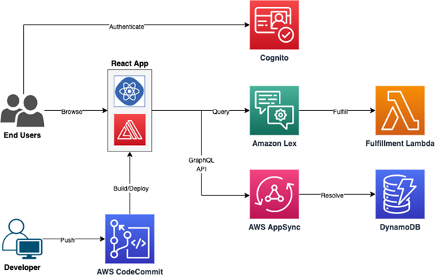

# Building a Serverless Conversational AI Assistant with AWS Amplify and Amazon Lex

This project demonstrates how to build a **serverless conversational AI assistant** using **AWS Amplify**, **Amazon Lex**, and **AWS Lambda**. The AI assistant can help interact with AWS services like **EC2** and **S3** via voice and text commands.

## Overview

This project leverages AWS services to build a chatbot that can perform basic operations like listing EC2 instances, describing S3 buckets, and managing users via an interactive conversational interface. The project uses **AWS Amplify** for hosting the frontend, **Amazon Lex** for natural language processing, and **AWS Lambda** for backend processing.

## Features

- **Conversational Interface**: Uses Amazon Lex for conversational AI.
- **User Authentication**: Managed through Amazon Cognito.
- **Interaction with AWS Services**: Lists EC2 instances and S3 buckets.
- **Serverless Architecture**: Backend powered by AWS AppSync and GraphQL And DynamoDB
- **Responsive Web Interface**: Built with React.js.

## Technologies Used

- **AWS Amplify**: For building and deploying the app in a serverless environment.
- **Amazon Lex**: For creating the conversational AI chatbot.
- **AWS Lambda**: For running backend logic.
- **Amazon Cognito**: For user authentication and management.
- **React.js**: Frontend framework for building the web interface.
- **AWS AppSync**: For exposing APIs to interact with Lambda functions.

## Architecture




- **Frontend (React.js)**: Interacts with users and connects to **Amazon Lex** via AWS Amplify.
- **Amazon Lex**: Handles natural language understanding, identifies intents, and passes relevant data to **AWS Lambda**.
- **AWS Lambda**: Executes business logic, interacts with **EC2** and **S3**, and returns responses to the frontend.
- **Amazon Cognito**: Manages user authentication and session handling.

## Getting Started

### Prerequisites

- AWS account with permissions to use **AWS Amplify**, **Amazon Lex**, **AWS Lambda**, and **Amazon Cognito**.
- **AWS CLI** installed and configured with your credentials.
- **Node.js** and **npm** installed.

### Setup Instructions

1. **Clone the Repository**:
   ```bash
   https://github.com/AreenHalabe/chat_bot.git
   cd thir-proj2
2. **Install Dependencies**:
   ```bash
   npm install
3. **Start the React App**
   ```bash
   npm start
Open the app in your browser at http://localhost:3000.

Usage 

